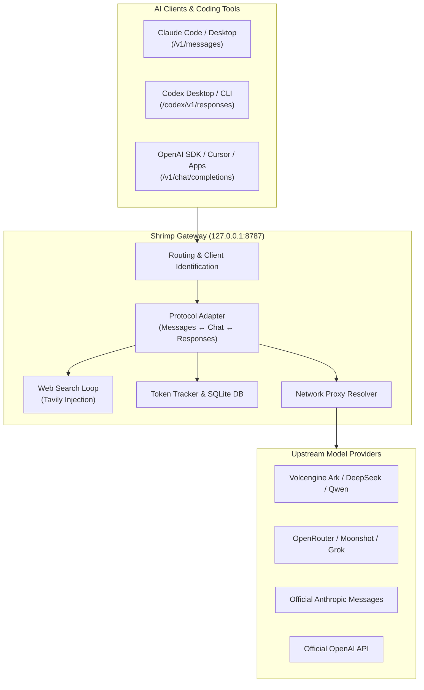

# 🦐 Shrimp (Shrimp AI Gateway)

<p align="center">
  
  
  
  
</p>

<p align="center">
  <b>Language Options:</b><br />
  <a href="./README.md"><b>English</b></a> | <a href="./README.zh-CN.md"><b>简体中文</b></a>
</p>

---

**Shrimp** is a high-performance, lightweight local AI proxy & protocol routing gateway designed for **Claude Code, Codex Desktop, Claude Desktop, and OpenAI-compatible clients**.

It effortlessly bridges third-party model providers (Volcengine Ark, DeepSeek, Qwen, OpenRouter, Grok, Moonshot, Anthropic) into your favorite coding assistants, offering **protocol translation, automatic web search injection, token analytics, and a sleek web management UI**.

---

## ✨ Key Features

- 🔀 **Universal Protocol Adapter**: Seamlessly converts requests across **Anthropic Messages**, **OpenAI Chat Completions**, and **OpenAI Responses (Codex)** protocols.
- 🔒 **Zero-Leak Secret Separation**: Public routing configurations (`gateway.config.json`) are completely isolated from credentials (`gateway.secrets.json`), supporting environment variable references (`env:YOUR_KEY`).
- 🌐 **Automatic Web Search Injection**: Injects `web_search` capabilities into models lacking native web search (e.g. GLM, DeepSeek) using Tavily without client modifications.
- 📊 **Real-time Token Analytics**: Built-in SQLite logger and dashboard for tracking prompt/completion token consumption across clients, models, and purposes.
- 🌐 **Multi-mode Network Proxy**: Configurable per-node routing (Global Proxy, Direct Connection, Custom Proxy).
- 🖥️ **Agent-Native CLI & Web Panel**: Interactive web dashboard at `http://127.0.0.1:8787/config` alongside full-featured CLI support (`shrimp`).

---

## 🏗️ Architecture Overview



---

## 🚀 Quick Start

### 1. Global Installation

```bash
npm install -g @wuhezhizhong/shrimp
```

### 2. Initialize Configuration

Run initial setup to generate default templates:

```bash
shrimp init
```

### 3. Start Gateway & Open Web UI

Start the background service and launch the web dashboard:

```bash
shrimp start
```

Open **`http://127.0.0.1:8787/config`** in your browser to manage endpoints, model mappings, and proxy settings.

---

## 💻 Agent-Native CLI Usage

Shrimp provides a comprehensive CLI for automated workflows, AI agent integrations, and manual management:

```bash
# General status & diagnostic
shrimp status
shrimp doctor
shrimp schema

# Endpoint management
shrimp endpoint add --client code --name demo --type openai-chat --base-url https://example.com/v1/chat/completions
shrimp endpoint list
shrimp client apply --client code

# Service control
shrimp start
shrimp restart
shrimp stop

# Installation helpers for AI skills and CLI tools
shrimp skill install -- npx -y skills add owner/repo --skill foo
shrimp cli-tool install -- npm i -g some-cli
```

> **Tip for Humans**: By default, CLI outputs structured JSON for AI agents. Append `--format pretty` for human-friendly formatting.

---

## ⚙️ Configuration & Secrets Management

Shrimp enforces strict security isolation between public routing logic and private API keys:

1. **`gateway.config.json`** *(Public, safe to commit)*: Stores server settings, client definitions, model mappings, and endpoint routing rules.
2. **`gateway.secrets.json`** *(Private, git-ignored)*: Stores API credentials keyed by stable endpoint IDs (`ep_...`):

```json
{
  "api_keys": {
    "ep_0017ac99-bf2d-4a7a-a70e-5f049c88054e": "env:ARK_API_KEY",
    "ep_7c8b91e1-43cd-4dc7-bd13-7ca32a511cee": "sk-your-private-key"
  }
}
```

---

## 🔌 Client Setup Guides

### 1. Claude Code
Set `ANTHROPIC_BASE_URL` in `~/.claude/settings.json` to point to Shrimp:

```json
{
  "env": {
    "ANTHROPIC_BASE_URL": "http://127.0.0.1:8787/code",
    "ANTHROPIC_DEFAULT_SONNET_MODEL": "claude-sonnet-4-5",
    "ANTHROPIC_DEFAULT_SONNET_MODEL_NAME": "glm-5.2"
  },
  "model": "sonnet"
}
```

### 2. Codex Desktop
Set base URL in `~/.codex/config.toml` or let Shrimp sync automatically:

```toml
model_provider = "local-gateway"
model_catalog_json = "~/.codex/gateway-model-catalog.json"

[model_providers.local-gateway]
name = "Shrimp Gateway"
base_url = "http://127.0.0.1:8787/codex/v1"
wire_format = "responses"
```

### 3. OpenAI-Compatible Clients
Point any OpenAI SDK or client to `http://127.0.0.1:8787/v1`.

---

## 🔍 Gateway Web Search

Inject web search capabilities into models like GLM or DeepSeek:
1. Add an endpoint with `"purpose": "web_search"` and `"provider": "tavily"`.
2. Add your Tavily API key to `gateway.secrets.json` under the search endpoint ID.
3. Shrimp automatically injects search tools, executes query loops, and returns final answers.

---

## 📊 Development & Verification

```bash
# Run unit & adapter tests
npm run check
npm run test:cli
npm run test:adapters

# Verify config & endpoints
npm run validate:config
```

---

## 📄 License

[MIT License](./LICENSE) © Shrimp Contributors
