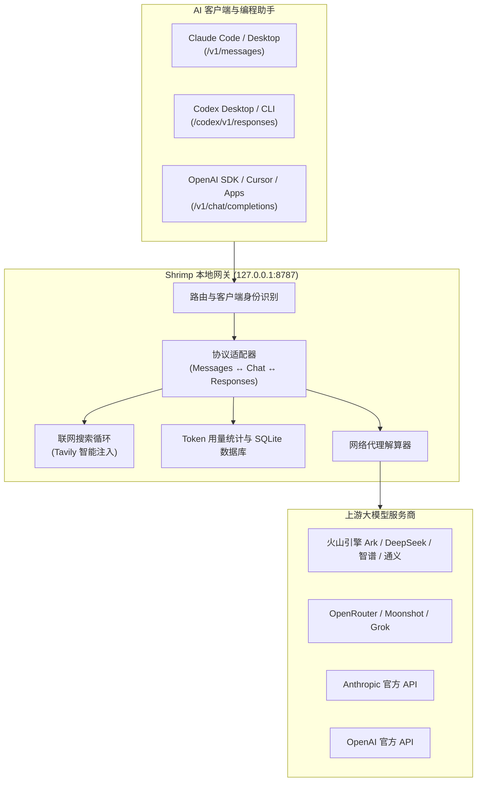

# 🦐 Shrimp (Shrimp AI Gateway)

<p align="center">
  
  
  
  
</p>

<p align="center">
  <b>语言切换：</b><br />
  <a href="./README.md"><b>English</b></a> | <a href="./README.zh-CN.md"><b>简体中文</b></a>
</p>

---

**Shrimp** 是一款专为 **Claude Code、Codex Desktop、Claude Desktop 及 OpenAI 兼容客户端** 设计的高性能、轻量级本地 AI 代理路由网关。

它能够无缝地将各种第三方模型提供商（火山引擎方舟 Ark、DeepSeek、Qwen、OpenRouter、Grok、Moonshot、Anthropic 官方等）桥接到您常用的 AI 编码助手与客户端中，并提供 **全协议自动转换、联网搜索增强、Token 用量统计与可视化控制面板**。

---

## ✨ 核心特性

- 🔀 **全协议智能适配器**：支持在 **Anthropic Messages**、**OpenAI Chat Completions** 及 **OpenAI Responses (Codex)** 协议之间自由相互转换。
- 🔒 **零泄露密钥隔离设计**：公开路由配置（`gateway.config.json`）与私密 API 密钥（`gateway.secrets.json`）彻底解耦，支持环境变量引用（`env:YOUR_KEY`）。
- 🌐 **内置联网搜索增强 (Web Search)**：无需客户端改动，自动为缺少原生搜索能力的模型（如 GLM、DeepSeek）注入基于 Tavily 的网络搜索工具循环。
- 📊 **实时 Token 统计与大盘**：内置 SQLite 数据库，全量记录与分析 Prompt / Completion Token 用量，按客户端、模型、场景多维聚合统计。
- 🌐 **多模式网络代理控制**：支持全局代理、节点级直连、节点级自定义代理三态精准切换。
- 🖥️ **Agent-Native CLI & Web 控制面板**：提供优雅的浏览器控制台（`http://127.0.0.1:8787/config`）与完整的命令行工具链（`shrimp`）。

---

## 🏗️ 架构拓扑



---

## 🚀 快速上手

### 1. 全局安装

```bash
npm install -g @wuhezhizhong/shrimp
```

### 2. 初始化配置文件

运行初始化指令，生成默认配置模板：

```bash
shrimp init
```

### 3. 启动网关与 Web 控制面板

启动后台服务并打开 Web 管理界面：

```bash
shrimp start
```

在浏览器打开 **`http://127.0.0.1:8787/config`**，即可轻松配置节点、模型映射及网络代理。

---

## 💻 命令行用法 (Agent-Native CLI)

Shrimp 提供了强大的命令行工具，适用于自动化脚本、AI Agent 集成及日常运维：

```bash
# 状态与诊断
shrimp status
shrimp doctor
shrimp schema

# 节点配置管理
shrimp endpoint add --client code --name demo --type openai-chat --base-url https://example.com/v1/chat/completions
shrimp endpoint list
shrimp client apply --client code

# 服务生命周期管理
shrimp start
shrimp restart
shrimp stop

# AI Skill / CLI 工具一键安装助手
shrimp skill install -- npx -y skills add owner/repo --skill foo
shrimp cli-tool install -- npm i -g some-cli
```

> **人类阅读提示**：CLI 默认输出供 AI Agent 调用的 JSON 格式。人类用户可添加 `--format pretty` 获取精美排版输出。

---

## ⚙️ 配置文件与密钥管理

Shrimp 严格执行公开配置与私密密钥的分离管理：

1. **`gateway.config.json`** *(公开路由文件，可提交到 Git)*：存储服务器端口、客户端映射及节点路由规则。
2. **`gateway.secrets.json`** *(私密密钥文件，已被 Git 忽略)*：根据稳定的节点 ID (`ep_...`) 存储敏感 API 密钥：

```json
{
  "api_keys": {
    "ep_0017ac99-bf2d-4a7a-a70e-5f049c88054e": "env:ARK_API_KEY",
    "ep_7c8b91e1-43cd-4dc7-bd13-7ca32a511cee": "sk-your-private-key"
  }
}
```

---

## 🔌 常见客户端配置指南

### 1. Claude Code
在 `~/.claude/settings.json` 中配置 `ANTHROPIC_BASE_URL` 指向 Shrimp：

```json
{
  "env": {
    "ANTHROPIC_BASE_URL": "http://127.0.0.1:8787/code",
    "ANTHROPIC_DEFAULT_SONNET_MODEL": "claude-sonnet-4-5",
    "ANTHROPIC_DEFAULT_SONNET_MODEL_NAME": "glm-5.2"
  },
  "model": "sonnet"
}
```

### 2. Codex Desktop
在 `~/.codex/config.toml` 中配置或者让 Shrimp 自动同步：

```toml
model_provider = "local-gateway"
model_catalog_json = "~/.codex/gateway-model-catalog.json"

[model_providers.local-gateway]
name = "Shrimp Gateway"
base_url = "http://127.0.0.1:8787/codex/v1"
wire_format = "responses"
```

### 3. OpenAI 兼容客户端
将任何 OpenAI SDK 或客户端的 Base URL 设置为 `http://127.0.0.1:8787/v1` 即可。

---

## 🔍 联网搜索增强 (Web Search)

为缺少原生联网能力的模型（如 GLM 或 DeepSeek）开启联网：
1. 在配置界面添加用途为 `"purpose": "web_search"`，服务商为 `"provider": "tavily"` 的节点。
2. 在 `gateway.secrets.json` 中配置您的 Tavily API Key。
3. Shrimp 网关会在模型发起请求时自动注入搜索工具，执行搜索并总结结果返回。

---

## 📊 本地开发与校验

```bash
# 运行单元测试与适配器测试
npm run check
npm run test:cli
npm run test:adapters

# 校验配置文件与节点合法性
npm run validate:config
```

---

## 📄 开源许可证

[MIT License](./LICENSE) © Shrimp Contributors
